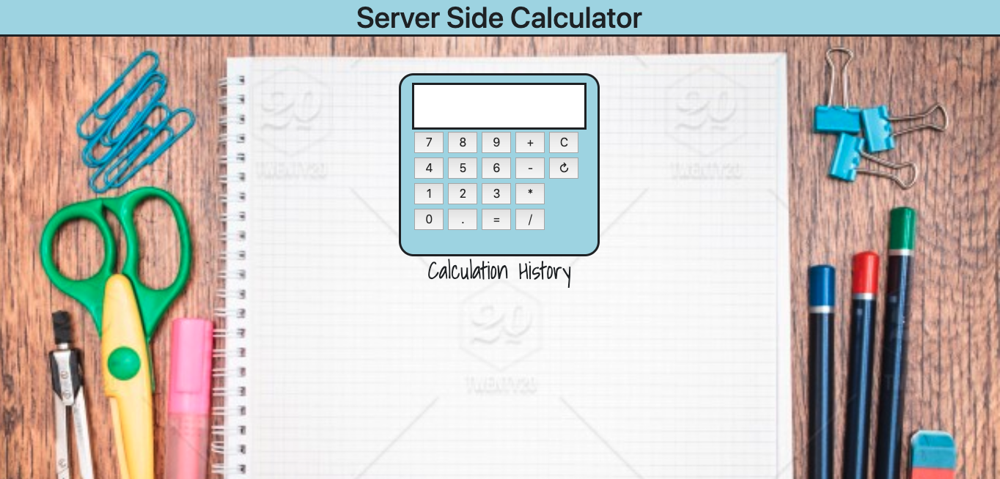
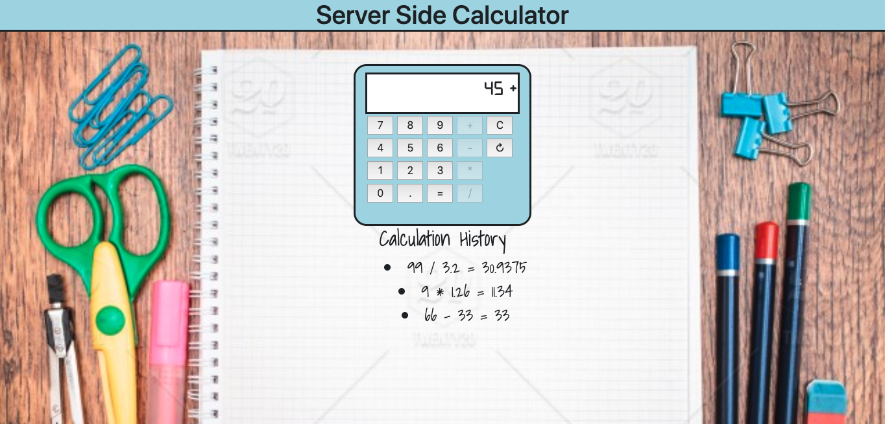

# Server Side Calculator

## Description

_Duration: 2 Days_

The purpose of this project was to create a calulator app that allowed the user to input two numbers and perform a mathematical operation (+, -, *, /) on them. An interface resembling a real calculator was created to allow for intuitive operation by a user. The history of calculations ran is displayed on the DOM for reference.

This project was used to learn more about setting up a server and client, making GET, POST, and delete requests/response, updating the DOM, and working with functions and Objects. A greater understanding of styling with CSS and Bootstrap was developed to make an intuitive user interface.

## Screen Shot

### Prerequisites

- [Node.js](https://nodejs.org/en/)

## Installation

1. Open up your editor of choice and run an `npm install`
2. Run `npm run server` in your terminal
3. Open a brower and search localhost:5000

## Usage
The application runs like a physical calculator.

1. Enter a number (positive, negative, integer, or decimal) by clicking on the corresponding button on the interface.
2. Select an operation by clicking the +, -, *, or / buttons on the interface.
3. Add a second number and click the equals (=) key.
4. The result will be displayed on the calculator display and a history will be shown below the calculator.
5. If a mistake is made entering a number, the 'C' button on the interface will clear both numbers and any operator that has been selected.
6. At any time, the refresh key can be clicked to clear the calculation history.

## Built With

1. Javascript
2. jQuery
3. HTML
4. CSS and Bootstrap

## Acknowledgement
Thanks to [Prime Digital Academy](www.primeacademy.io) Dijkastra cohort who equipped and helped me to make this application a reality.

## Support
If you have suggestions or issues, please email me at [zbattaglia3@gmail.com(www.google.com)